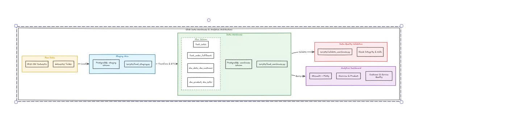
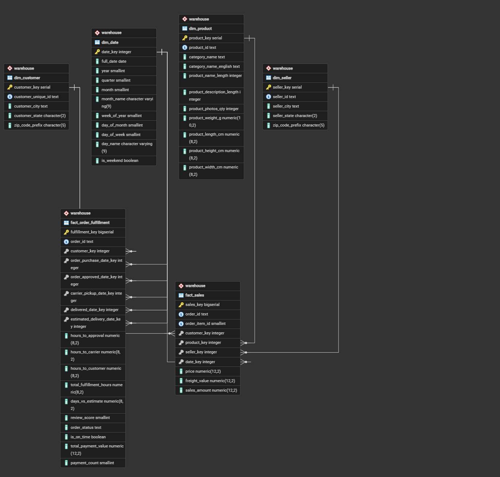

# Olist E-Commerce Data Warehouse & Analytics

Kho dữ liệu (Data Warehouse) và Dashboard phân tích cho bộ dữ liệu **Olist Brazilian E-Commerce**.

Pipeline tự động chuyển 9 tệp CSV thô thành mô hình **Kimball Star Schema** trên PostgreSQL, kiểm định chất lượng với 72 automated checks, và trực quan hóa kết quả qua **Streamlit Dashboard** tương tác.



## Data Pipeline

```text
datasets/ (9 CSV)
      │
      ▼  load_staging.py ── COPY binary ──▶ staging schema (all TEXT)
      │
      ▼  olist_staging_views.sql ─────────▶ staging.vw_* (type cast, dedup, pre-agg)
      │
      ▼  load_warehouse.py ── 1 transaction ▶ warehouse schema (Star Schema)
      │
      ▼  validate_warehouse.py ───────────▶ 72 quality checks (69 PASS · 3 WARNING)
      │
      ▼  dashboard/ (Streamlit) ──────────▶ Interactive BI Dashboard
```

## Star Schema



**4 Dimensions + 2 Facts** trong schema `warehouse`:

| Bảng                         | Grain                         |    Rows |
| :--------------------------- | :---------------------------- | ------: |
| `dim_date`                   | 1 dòng / ngày (2016–2019)     |   1,461 |
| `dim_customer`               | 1 dòng / `customer_unique_id` |  96,096 |
| `dim_product`                | 1 dòng / `product_id`         |  32,951 |
| `dim_seller`                 | 1 dòng / `seller_id`          |   3,095 |
| **`fact_sales`**             | 1 dòng / order item           | 112,650 |
| **`fact_order_fulfillment`** | 1 dòng / order                |  99,441 |

- **`fact_sales`**: doanh thu sản phẩm — `price`, `freight_value`, `sales_amount`.
- **`fact_order_fulfillment`**: logistics & thanh toán — SLA hours, `review_score`, `total_payment_value`, `is_on_time`.

## Dashboard

Streamlit multi-page dashboard gồm 4 trang:

| Trang               | Nội dung                                                                        |
| :------------------ | :------------------------------------------------------------------------------ |
| **Overview**        | KPI tổng quan, doanh thu theo tháng, đơn hàng theo ngày trong tuần              |
| **Product**         | Top danh mục, doanh thu vs số lượng, giá trung bình theo ngành hàng             |
| **Customer**        | Phân bố khách hàng theo bang/thành phố, tỷ lệ mua lặp lại                       |
| **Service Quality** | Tỷ lệ giao đúng hạn, review score, thời gian giao theo bang, delivery vs review |

## Cấu trúc thư mục

```text
Olist/
├── datasets/              # 9 CSV dữ liệu thô Olist (bất biến)
├── sql/
│   ├── olist_staging.sql        # DDL staging (all TEXT columns)
│   ├── olist_staging_views.sql  # Views chuyển đổi & làm sạch
│   └── olist_dwh.sql            # DDL Star Schema warehouse
├── scripts/
│   ├── load_staging.py          # Nạp CSV → staging qua binary COPY
│   ├── load_warehouse.py        # Nạp warehouse trong 1 transaction
│   └── validate_warehouse.py    # 72 data quality checks
├── dashboard/
│   ├── app.py                   # Streamlit entrypoint
│   ├── pages/                   # Overview, Product, Customer, Service Quality
│   ├── charts.py                # Plotly chart builders
│   ├── query.py                 # SQL queries cho dashboard
│   └── db_connection.py         # SQLAlchemy + Streamlit caching
├── run_pipeline.py        # Orchestrator: staging → warehouse → validate → dashboard
├── requirements.txt       # Python dependencies
└── .env.example           # Mẫu cấu hình kết nối PostgreSQL
```

## Cài đặt

**Yêu cầu**: Python 3.10+, PostgreSQL 14+.

```bash
# 1. Cài thư viện
pip install -r requirements.txt

# 2. Cấu hình kết nối DB
cp .env.example .env
# Sửa .env với thông tin PostgreSQL của bạn
```

## Chạy Pipeline

```bash
# Chạy toàn bộ: staging → warehouse → validate → mở dashboard
python run_pipeline.py

# Chỉ chạy pipeline, không mở dashboard
python run_pipeline.py --skip-dashboard

# Chỉ mở dashboard (đã có dữ liệu trong warehouse)
python run_pipeline.py --dashboard-only
```

Pipeline hỗ trợ skip từng bước: `--skip-staging`, `--skip-warehouse`, `--skip-validation`.

Log được lưu tại `logs/pipeline_latest.log`.

**Chạy thủ công từng bước:**

```bash
python scripts/load_staging.py
python scripts/load_warehouse.py
python scripts/validate_warehouse.py
streamlit run dashboard/app.py
```

## Công nghệ

| Thành phần      | Công nghệ                        |
| :-------------- | :------------------------------- |
| Database        | PostgreSQL 14+                   |
| ETL             | Python, psycopg2 (`copy_expert`) |
| Dashboard       | Streamlit, Plotly                |
| Data processing | pandas, SQLAlchemy               |
| Config          | python-dotenv                    |

## License

MIT — xem [LICENSE](LICENSE).
