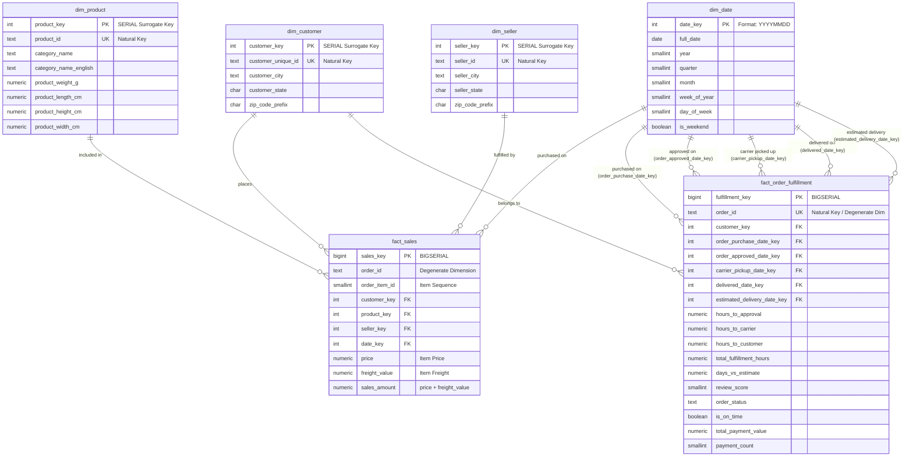

# Olist Data Warehouse — Dimensional Model (Kimball Star Schema)

Tài liệu này là đặc tả kỹ thuật chi tiết nhất về cấu trúc Kho dữ liệu (Data Warehouse) của dự án Olist Brazilian E-Commerce, được trích xuất và đối chiếu trực tiếp từ mã nguồn DDL (`sql/olist_dwh.sql`) và mã nạp ETL (`scripts/load_warehouse.py`).

---

## 1. Sơ đồ quan hệ thực thể (Star Schema ERD)

DWH được xây dựng theo mô hình **Kimball Star Schema** gồm **2 bảng Fact** và **4 bảng Dimension**:



---

## 2. Quy ước đặt tên & Thiết kế khóa (Conventions)

1. **Surrogate Key**: Luôn có hậu tố `_key` (ví dụ: `customer_key`, `product_key`, `date_key`, `sales_key`).
   - Tạo bằng `SERIAL` hoặc `BIGSERIAL` (tự động tăng, độc lập hoàn toàn với khóa nguồn).
   - Riêng `dim_date` dùng số nguyên `INT` định dạng `YYYYMMDD` (ví dụ: `20180105`) để hỗ trợ partition và dễ đọc.
2. **Business Key (Natural Key)**: Luôn có hậu tố `_id` (ví dụ: `customer_unique_id`, `product_id`, `seller_id`, `order_id`). Dùng kiểu `TEXT`.
3. **Degenerate Dimension**: Cột `order_id` xuất hiện trực tiếp trong cả hai bảng Fact mà không cần bảng `dim_order` riêng biệt, theo đúng chuẩn Kimball cho đơn hàng e-commerce.

---

## 3. Chi tiết các bảng Fact (Fact Tables)

### 3.1. `warehouse.fact_sales`

- **Mục đích nghiệp vụ**: Lưu trữ chi tiết từng món hàng (line-item) được giao dịch, phản ánh doanh thu sản phẩm, phí vận chuyển của từng mặt hàng và hiệu quả bán hàng của từng người bán (seller).
- **Mức độ chi tiết (Grain)**: **Chính xác 1 dòng cho mỗi order item (`order_id`, `order_item_id`)**.
- **Tổng số dòng thực tế**: **112,650 dòng**.
- **Khóa chính (PK)**: `sales_key` (`BIGSERIAL`).
- **Ràng buộc duy nhất (Unique Constraint)**: `UNIQUE(order_id, order_item_id)`.
- **Khóa ngoại (FK)**:
  - `customer_key` $\rightarrow$ `warehouse.dim_customer(customer_key)`
  - `product_key` $\rightarrow$ `warehouse.dim_product(product_key)`
  - `seller_key` $\rightarrow$ `warehouse.dim_seller(seller_key)`
  - `date_key` $\rightarrow$ `warehouse.dim_date(date_key)` (nối theo ngày mua hàng `order_purchase_timestamp::DATE`).
- **Thước đo (Measures)**:
  - `price` (`NUMERIC(12,2)`): Đơn giá của món hàng (BRL).
  - `freight_value` (`NUMERIC(12,2)`): Cước vận chuyển phân bổ cho món hàng đó (BRL).
  - `sales_amount` (`NUMERIC(12,2)`): Tổng giá trị món hàng = `price + freight_value` (BRL).
- **Trường Degenerate Dimension**:
  - `order_id` (`TEXT`): Mã đơn hàng từ hệ thống nguồn.
  - `order_item_id` (`SMALLINT`): Số thứ tự món hàng trong đơn (1, 2, 3...).
- **Các ca phân tích điển hình**:
  - Doanh thu theo ngày/tháng/năm/quý.
  - Top danh mục sản phẩm bán chạy nhất, sản phẩm mang lại doanh thu cao nhất.
  - Doanh thu và phí vận chuyển theo khu vực người bán (seller state/city) và khách hàng.
  - Tỷ trọng phí vận chuyển trên giá trị món hàng (`freight_value / price`).
- **Cảnh báo Join & Aggregation**:
  > [!WARNING]
  > Không được join trực tiếp `fact_sales` với `fact_order_fulfillment` trên `order_id` rồi thực hiện phép cộng `SUM(fact_order_fulfillment.total_payment_value)`. Với các đơn hàng có nhiều món (multi-item orders), giá trị thanh toán của đơn hàng sẽ bị **nhân đôi/nhân ba (fan-out / join multiplication)**!

---

### 3.2. `warehouse.fact_order_fulfillment`

- **Mục đích nghiệp vụ**: Theo dõi toàn bộ vòng đời xử lý đơn hàng (Logistics & SLA Lifecycle), mức độ hài lòng của khách hàng (Review score), trạng thái đơn hàng và thanh toán gộp ở cấp đơn.
- **Mức độ chi tiết (Grain)**: **Chính xác 1 dòng cho mỗi đơn hàng (`order_id`)**.
- **Tổng số dòng thực tế**: **99,441 dòng**.
- **Khóa chính (PK)**: `fulfillment_key` (`BIGSERIAL`).
- **Ràng buộc duy nhất**: `order_id` (`TEXT NOT NULL UNIQUE`).
- **Khóa ngoại (FK)**:
  - `customer_key` $\rightarrow$ `warehouse.dim_customer(customer_key)`
  - Role-playing dates (5 khóa ngoại cùng nối sang `warehouse.dim_date`):
    - `order_purchase_date_key`: Ngày đặt hàng.
    - `order_approved_date_key`: Ngày phê duyệt thanh toán.
    - `carrier_pickup_date_key`: Ngày hãng vận chuyển tiếp nhận kiện hàng.
    - `delivered_date_key`: Ngày giao kiện hàng thành công đến tay khách hàng.
    - `estimated_delivery_date_key`: Ngày giao hàng dự kiến ban đầu do sàn cam kết.
- **Thước đo & Chỉ số SLA (Measures & SLA Durations)**:
  - `hours_to_approval` (`NUMERIC(8,2)`): Thời gian duyệt đơn (giờ) = `(order_approved_at - order_purchase_timestamp) / 3600`. Nhận `NULL` nếu mốc thời gian ngược hoặc thiếu.
  - `hours_to_carrier` (`NUMERIC(8,2)`): Thời gian bàn giao cho bên vận chuyển (giờ) = `(order_delivered_carrier_date - order_approved_at) / 3600`. Nhận `NULL` nếu thời gian ngược.
  - `hours_to_customer` (`NUMERIC(8,2)`): Thời gian vận chuyển đường dài (giờ) = `(order_delivered_customer_date - order_delivered_carrier_date) / 3600`.
  - `total_fulfillment_hours` (`NUMERIC(8,2)`): Tổng thời gian từ đặt hàng đến khi nhận hàng (giờ) = `(order_delivered_customer_date - order_purchase_timestamp) / 3600`.
  - `days_vs_estimate` (`NUMERIC(8,2)`): Số ngày giao lệch so với dự kiến = `(order_delivered_customer_date - order_estimated_delivery_date) / 86400`. Giá trị dương = giao trễ hạn; giá trị âm = giao sớm hơn dự kiến.
  - `is_on_time` (`BOOLEAN`): `TRUE` nếu giao đúng hạn (`delivered <= estimated`), `FALSE` nếu trễ hạn, `NULL` nếu đơn chưa giao hoặc thiếu mốc thời gian.
  - `review_score` (`SMALLINT`): Điểm đánh giá (1 đến 5 sao). Lấy review mới nhất theo thời gian tạo review.
  - `total_payment_value` (`NUMERIC(12,2)`): Tổng tiền thanh toán của đơn hàng đã được pre-aggregate từ các đợt/phương thức thanh toán.
  - `payment_count` (`SMALLINT`): Số lượng giao dịch thanh toán của đơn hàng (ví dụ: trả góp hoặc kết hợp nhiều thẻ/voucher).
- **Trường Degenerate Dimension**:
  - `order_status` (`TEXT`): Trạng thái đơn hàng (`delivered`, `shipped`, `canceled`, `invoiced`, `processing`, `unavailable`).
- **Các ca phân tích điển hình**:
  - Tỷ lệ giao hàng đúng hẹn (On-time Delivery Rate) theo tháng hoặc theo bang.
  - Thời gian xử lý đơn trung bình qua từng chặng (Phê duyệt $\rightarrow$ Xuất kho $\rightarrow$ Giao hàng).
  - Tác động của việc giao trễ hạn (`days_vs_estimate > 0`) lên điểm đánh giá khách hàng (`review_score`).
  - Phân tích đơn hàng bị hủy (`order_status = 'canceled'`).

---

## 4. Chi tiết các bảng Dimension (Dimension Tables)

### 4.1. `warehouse.dim_customer`

- **Ý nghĩa nghiệp vụ**: Đại diện cho khách hàng cá nhân thực tế tại Brazil.
- **Mức độ chi tiết (Grain)**: **1 dòng cho mỗi `customer_unique_id`**.
- **Tổng số dòng thực tế**: **96,096 dòng**.
- **Khóa chính**: `customer_key` (`SERIAL`).
- **Khóa tự nhiên**: `customer_unique_id` (`TEXT NOT NULL UNIQUE`).
- **Thuộc tính quan trọng**:
  - `customer_city` (`TEXT`): Thành phố của khách hàng.
  - `customer_state` (`CHAR(2)`): Mã 2 ký tự của bang tại Brazil (ví dụ: SP, RJ, MG).
  - `zip_code_prefix` (`CHAR(5)`): 5 chữ số đầu của mã bưu chính (CEP Brazil).
- **Lưu ý đặc biệt**:
  - Trong hệ thống Olist, mỗi đơn hàng sinh ra một `customer_id` mới. Tuy nhiên, một khách hàng thực sự được định danh duy nhất bởi `customer_unique_id`.
  - Bảng `dim_customer` đã được **khử trùng lặp (deduplicated)** theo quy tắc: chọn vị trí địa lý xuất hiện nhiều lần nhất của khách hàng đó (kèm tie-breaker rõ ràng), đảm bảo tính nhất quán cho phân tích khách hàng quay lại (repeat customers).

---

### 4.2. `warehouse.dim_date`

- **Ý nghĩa nghiệp vụ**: Chiều thời gian chuẩn hóa cho mọi phân tích theo chuỗi thời gian (Time-Series).
- **Mức độ chi tiết (Grain)**: **1 dòng cho mỗi ngày lịch**.
- **Dải thời gian**: Từ `2016-01-01` đến `2019-12-31` (toàn bộ vòng đời dữ liệu Olist).
- **Tổng số dòng thực tế**: **1,461 dòng** (đầy đủ, không đứt đoạn ngày).
- **Khóa chính**: `date_key` (`INT`), format `YYYYMMDD` (ví dụ: `20171124`).
- **Thuộc tính quan trọng**:
  - `full_date` (`DATE`): Ngày theo chuẩn ISO.
  - `year` (`SMALLINT`), `quarter` (`SMALLINT` 1-4), `month` (`SMALLINT` 1-12), `month_name` (`VARCHAR(9)`).
  - `week_of_year` (`SMALLINT`), `day_of_month` (`SMALLINT`), `day_of_week` (`SMALLINT`, 1=Chủ Nhật ... 7=Thứ Bảy), `day_name` (`VARCHAR(9)`).
  - `is_weekend` (`BOOLEAN`): `TRUE` vào Thứ Bảy và Chủ Nhật.
- **Lưu ý đặc biệt**:
  - Hỗ trợ Role-playing Dimensions: 1 bảng `dim_date` được tái sử dụng để join với 5 mốc thời gian khác nhau trong `fact_order_fulfillment`.

---

### 4.3. `warehouse.dim_product`

- **Ý nghĩa nghiệp vụ**: Lưu trữ thông tin danh mục và đặc tính vật lý của từng mặt hàng được niêm yết.
- **Mức độ chi tiết (Grain)**: **1 dòng cho mỗi `product_id`**.
- **Tổng số dòng thực tế**: **32,951 dòng**.
- **Khóa chính**: `product_key` (`SERIAL`).
- **Khóa tự nhiên**: `product_id` (`TEXT NOT NULL UNIQUE`).
- **Thuộc tính quan trọng**:
  - `category_name` (`TEXT`): Tên danh mục gốc bằng tiếng Bồ Đào Nha (ví dụ: `cama_mesa_banho`).
  - `category_name_english` (`TEXT`): Tên danh mục tiếng Anh đã dịch (ví dụ: `bed_bath_table`). Nếu không có bản dịch, tự động fallback về `category_name` hoặc `'unknown'`.
  - `product_name_length` (`INT`): Số ký tự tiêu đề sản phẩm.
  - `product_description_length` (`INT`): Số ký tự mô tả sản phẩm.
  - `product_photos_qty` (`INT`): Số ảnh sản phẩm.
  - `product_weight_g` (`NUMERIC(10,2)`): Khối lượng sản phẩm (gram).
  - `product_length_cm`, `product_height_cm`, `product_width_cm` (`NUMERIC(8,2)`): Kích thước sản phẩm (cm).

---

### 4.4. `warehouse.dim_seller`

- **Ý nghĩa nghiệp vụ**: Lưu trữ danh tính và vị trí địa lý của đối tác người bán (merchants / vendors).
- **Mức độ chi tiết (Grain)**: **1 dòng cho mỗi `seller_id`**.
- **Tổng số dòng thực tế**: **3,095 dòng**.
- **Khóa chính**: `seller_key` (`SERIAL`).
- **Khóa tự nhiên**: `seller_id` (`TEXT NOT NULL UNIQUE`).
- **Thuộc tính quan trọng**:
  - `seller_city` (`TEXT`): Thành phố người bán đăng ký.
  - `seller_state` (`CHAR(2)`): Mã 2 ký tự của bang người bán (ví dụ: SP, PR, SC).
  - `zip_code_prefix` (`CHAR(5)`): Tiền tố mã bưu chính.

---

## 5. Rủi ro Join & Hướng dẫn phối hợp dữ liệu (Join Multiplication Warnings)

### Rủi ro 1: Join giữa `fact_sales` và `fact_order_fulfillment`
- **Nguyên nhân**: `fact_sales` có grain là cấp order item (1 đơn có thể có $N$ items), còn `fact_order_fulfillment` có grain là cấp order ($1$ dòng / đơn).
- **Hậu quả**: Khi thực hiện `JOIN ... ON s.order_id = f.order_id`, các thước đo của `fact_order_fulfillment` (như `total_payment_value`, `total_fulfillment_hours`) sẽ bị lặp lại $N$ lần. Nếu chạy `SUM(f.total_payment_value)` sẽ ra kết quả sai lệch nghiêm trọng.
- **Giải pháp đúng**:
  - Nếu muốn đối soát hoặc tính tổng hợp: Hãy pre-aggregate `fact_sales` ở cấp `order_id` trong CTE/Subquery trước khi join sang `fact_order_fulfillment`.
  ```sql
  WITH order_sales_agg AS (
      SELECT 
          order_id,
          SUM(sales_amount) AS total_sales,
          COUNT(*)          AS item_count
      FROM warehouse.fact_sales
      GROUP BY order_id
  )
  SELECT 
      f.order_id,
      f.total_payment_value,
      s.total_sales,
      s.item_count
  FROM warehouse.fact_order_fulfillment f
  JOIN order_sales_agg s ON f.order_id = s.order_id;
  ```

### Rủi ro 2: Khác biệt giữa Doanh số (`sales_amount`) và Thanh toán (`total_payment_value`)
- `sales_amount` trong `fact_sales` là tổng giá niêm yết của các món hàng + phí ship.
- `total_payment_value` trong `fact_order_fulfillment` là số tiền khách thực tế trả (đã áp dụng voucher, coupon, điểm thưởng hoặc phụ phí tín dụng).
- Trong validation report, có khoảng 256 đơn hàng chênh lệch giá trị $> 1\%$. Khi phân tích doanh thu sản phẩm, hãy dùng `fact_sales.sales_amount`. Khi phân tích dòng tiền thu thực tế, hãy dùng `fact_order_fulfillment.total_payment_value`.

### Rủi ro 3: Sử dụng đúng Role-Playing Date Key
Trong `fact_order_fulfillment`, có tới 5 date keys:
- Muốn phân tích theo **ngày khách đặt hàng**: Join `order_purchase_date_key` với `dim_date.date_key`.
- Muốn phân tích theo **ngày khách thực tế nhận hàng**: Join `delivered_date_key` với `dim_date.date_key`.
- Tuyệt đối không nhầm lẫn giữa hai mốc này vì độ trễ giao hàng trung bình tại Brazil kéo dài từ vài ngày đến vài tuần.
